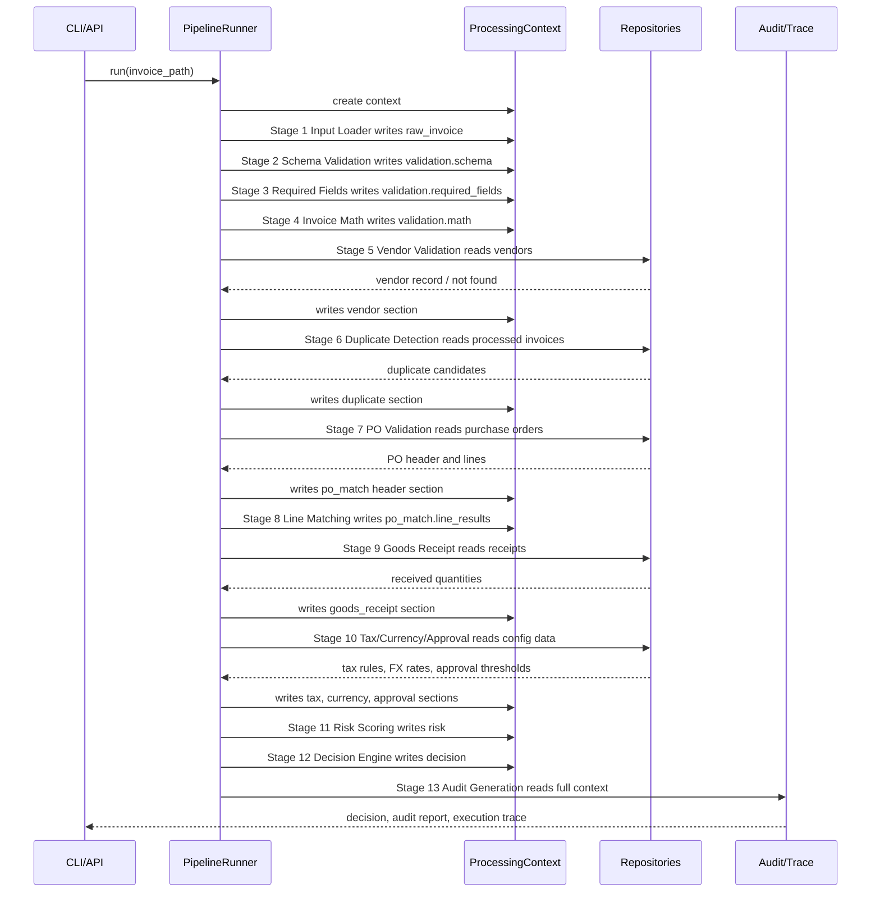
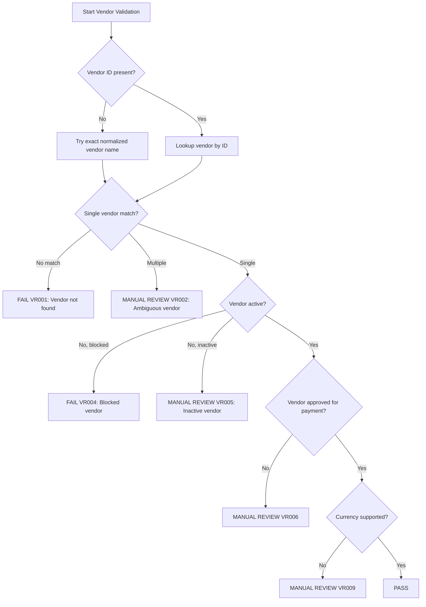
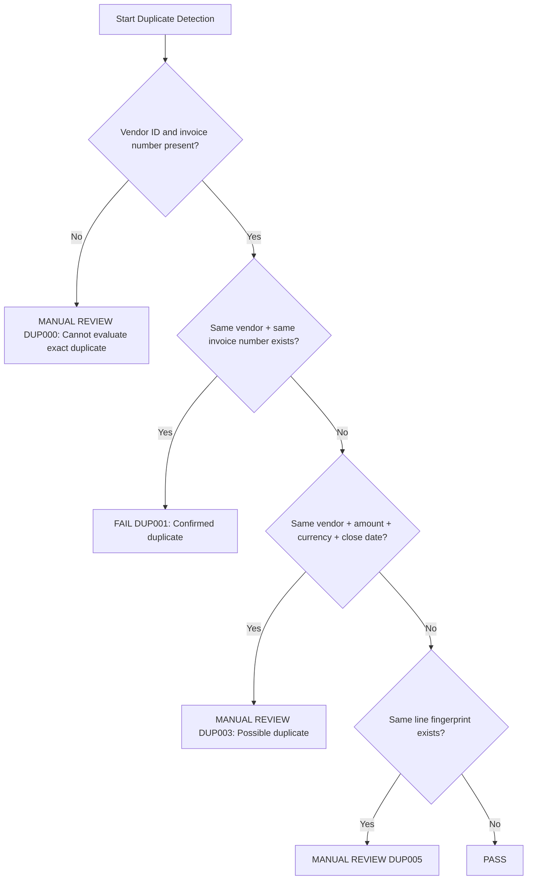
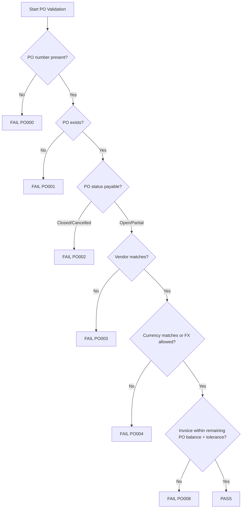
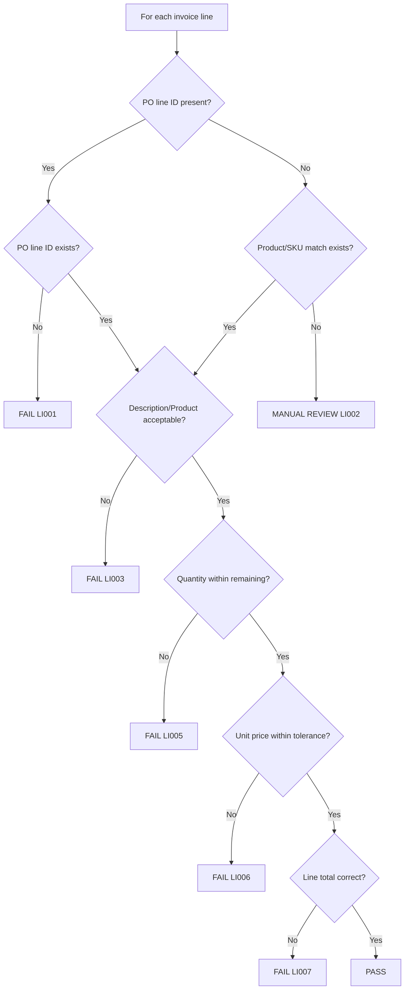

# Software Design Document: Production-Grade AP Invoice Processing System

## 1. Purpose

This document defines the design for a production-grade Accounts Payable invoice processing engine for the Zamp PS-1 case study. It assumes invoice extraction has already produced structured JSON. OCR, PDF parsing, email ingestion, UI, and LLM integration are out of scope for this phase.

The system must process invoice JSON, validate it against finance controls, match it against vendor and procurement reference data, calculate risk, produce an explainable decision, and generate audit artifacts.

Outputs:

- `decision.json`
- `audit_report.json`
- `execution_trace.json`

## 2. High-Level Architecture

The system follows a Clean Architecture pipeline:

- `domain`: AP entities, value objects, rule results, decisions, context sections.
- `repositories`: interfaces for vendor, invoice history, PO, goods receipt, tax, FX, approval data.
- `rules`: reusable deterministic finance validators.
- `stages`: pipeline stages that orchestrate related rules.
- `risk`: risk scoring strategy.
- `decision`: decision policy and confidence calculation.
- `audit`: trace and audit report generation.
- `config`: tolerances, thresholds, risk weights, approval matrix.
- `app`: use-case orchestration.

Pipeline stages read a shared `ProcessingContext`, write only their owned section, and never directly invoke another stage.

## 3. Pipeline Sequence Diagram



## 4. Pipeline Stages

### Stage 1: Input Loader

Purpose: Load structured invoice JSON.

Inputs: invoice file path.

Outputs: `context.raw_invoice_data`.

Dependencies: file system or future object storage.

Failures: file missing, invalid JSON, non-object payload.

Algorithm:

1. Read file bytes.
2. Parse JSON.
3. Assert top-level payload is an object.
4. Store raw payload in context.
5. Emit execution trace.

Complexity: O(n) time and O(n) space where n is input JSON size.

### Stage 2: Schema Validation

Purpose: Convert raw JSON into typed invoice domain model.

Inputs: `context.raw_invoice_data`.

Outputs: `context.invoice`, `context.validation.schema`.

Dependencies: Pydantic models.

Failures: invalid date, invalid decimal, unsupported field type, unknown field where forbidden.

Algorithm:

1. Check raw payload exists.
2. Validate against `Invoice` schema.
3. Convert dates, decimals, currencies.
4. Store parsed invoice or schema findings.

Complexity: O(f + l), where f is number of invoice fields and l is line count.

### Stage 3: Required Field Validation

Purpose: Ensure minimum AP data exists before finance rules run.

Inputs: `context.invoice`.

Outputs: `context.validation.required_fields`.

Rules: RF001-RF009.

Algorithm:

1. For each required field, evaluate non-null/non-empty.
2. For invoice type, evaluate whether required fields differ for invoice, credit note, debit note.
3. Store rule results.

Complexity: O(r), where r is number of required fields.

### Stage 4: Invoice Math Validation

Purpose: Validate arithmetic integrity of invoice totals.

Inputs: invoice header and lines.

Outputs: `context.validation.math`.

Rules: MATH001-MATH008.

Algorithm:

1. For every line, calculate `quantity * unit_price`.
2. Compare calculated line amount to invoice line total.
3. Sum line totals.
4. Compare line sum to subtotal.
5. Calculate `subtotal + tax + freight - discount`.
6. Compare calculated total to invoice total using configured rounding tolerance.
7. Reject negative or zero invalid values according to invoice type.

Complexity: O(l), where l is invoice line count.

### Stage 5: Vendor Validation

Purpose: Validate that the vendor exists and is eligible for payment.

Inputs: invoice vendor ID/name/tax ID/currency.

Outputs: `context.vendor`.

Dependencies: `VendorRepository`.

Rules: VR001-VR012.

Algorithm:

1. Search vendor by vendor ID.
2. If not found, search by normalized legal name.
3. If multiple matches, route to manual review.
4. Validate status: active, approved, not blocked, not deleted.
5. Validate tax ID and currency compatibility.
6. Validate payment hold and bank-change indicators if available.

Complexity: O(1) for indexed DB lookup; O(v) for JSON scan.

### Stage 6: Duplicate Detection

Purpose: Prevent duplicate payments.

Inputs: invoice number, vendor ID, total, currency, date, normalized line signature.

Outputs: `context.duplicate`.

Dependencies: `InvoiceRepository`.

Rules: DUP001-DUP008.

Algorithm:

1. Query exact match by vendor ID and invoice number.
2. Query same invoice number across vendor group.
3. Query possible duplicate by vendor, amount, currency, and date window.
4. Query duplicate line fingerprint where supported.
5. Classify exact duplicate as reject.
6. Classify near duplicate as manual review.

Complexity: O(1) with indexes; O(p) for JSON processed invoices.

### Stage 7: Purchase Order Header Validation

Purpose: Confirm PO exists and can be invoiced.

Inputs: invoice PO number, vendor, currency, invoice date.

Outputs: `context.po_match.header`.

Dependencies: `PurchaseOrderRepository`.

Rules: PO001-PO012.

Algorithm:

1. Lookup PO by number.
2. Validate status is open or partially invoiced.
3. Validate PO vendor equals invoice vendor.
4. Validate PO currency equals invoice currency or FX conversion is allowed.
5. Validate invoice date is within PO effective date range.
6. Calculate remaining PO amount.
7. Validate invoice total against remaining amount and tolerance.

Complexity: O(1) indexed DB lookup; O(po) JSON scan.

### Stage 8: Line Item Matching

Purpose: Match invoice lines against PO lines.

Inputs: invoice lines, PO lines.

Outputs: `context.po_match.line_results`.

Rules: LI001-LI014.

Algorithm:

1. Build dictionary of PO lines by `po_line_id`.
2. For each invoice line:
   1. Match by `po_line_id` if present.
   2. Else match by SKU/product code if available.
   3. Else match by normalized description with deterministic similarity threshold.
3. Validate product identity.
4. Validate quantity.
5. Validate unit price.
6. Validate line total.
7. Detect duplicate invoice lines.
8. Store one result per invoice line.

Complexity: O(p + i) for ID/SKU matching; O(i * p) if fallback description matching is used.

### Stage 9: Quantity, Balance, and Partial Invoice Validation

Purpose: Ensure invoice does not exceed PO remaining quantity or amount.

Inputs: PO lines, invoice lines, prior processed invoices.

Outputs: `context.po_match.balance`.

Dependencies: PO and invoice repositories.

Rules: BAL001-BAL010.

Algorithm:

1. For each PO line, compute previously invoiced quantity and amount.
2. Compute remaining quantity and amount.
3. For each invoice line, subtract proposed invoice quantity and amount.
4. Fail if remaining quantity or amount becomes negative beyond tolerance.
5. Mark partial invoice as valid if PO remains positive after processing.

Complexity: O(p + h + i), where h is historical invoice line count.

### Stage 10: Three-Way Matching

Purpose: Validate invoice against PO and goods receipt.

Inputs: invoice lines, PO lines, goods receipts.

Outputs: `context.goods_receipt`.

Dependencies: `GoodsReceiptRepository`.

Rules: GR001-GR008.

Algorithm:

1. Determine whether vendor/PO category requires goods receipt.
2. Fetch receipts by PO number and line.
3. Aggregate received quantity by PO line.
4. Compare invoice quantity to received and not-yet-invoiced quantity.
5. Fail or review if goods not received.

Complexity: O(r + i), where r is receipt line count.

### Stage 11: Tax, Currency, Payment Terms, Approval Validation

Purpose: Validate configurable finance controls beyond PO match.

Inputs: invoice, vendor, PO, tax config, FX config, approval matrix.

Outputs: `context.tax`, `context.currency`, `context.payment_terms`, `context.approval`.

Dependencies: Tax, Currency, Approval repositories.

Rules: TAX001-TAX010, CUR001-CUR008, PT001-PT006, APP001-APP006.

Algorithm:

1. Fetch tax rule by vendor jurisdiction, buyer jurisdiction, item category, and date.
2. Calculate expected tax.
3. Validate tax amount and tax percentage.
4. Validate currency and FX rate freshness.
5. Validate due date against vendor/PO terms.
6. Resolve approval threshold by amount, department, risk level, and cost center.

Complexity: O(i) for tax by line; O(1) for config lookups with indexes.

### Stage 12: Risk Scoring

Purpose: Convert rule outcomes into an explainable risk score.

Inputs: all rule results.

Outputs: `context.risk`.

Dependencies: risk weights config.

Algorithm:

1. Initialize score = 0.
2. For each failed or warning rule, add configured weight.
3. Apply multipliers for fraud-sensitive combinations.
4. Cap score at 100.
5. Assign risk level.
6. Store reason list with rule IDs.

Complexity: O(r), where r is number of rule results.

### Stage 13: Decision Engine

Purpose: Produce APPROVED, REJECTED, or MANUAL_REVIEW.

Inputs: rule results, risk, approval result.

Outputs: `context.decision`.

Algorithm:

1. If any blocking reject rule failed, status = REJECTED.
2. Else if risk exceeds review threshold, status = MANUAL_REVIEW.
3. Else if approval matrix requires approver, status = MANUAL_REVIEW.
4. Else status = APPROVED.
5. Compute confidence from data completeness and match quality.
6. Generate reasoning from highest-impact rule outcomes.

Complexity: O(r).

### Stage 14: Audit and Execution Trace Generation

Purpose: Produce finance-readable and machine-readable outputs.

Inputs: full context.

Outputs: decision, audit report, execution trace.

Algorithm:

1. Serialize decision summary.
2. Serialize full audit context.
3. Serialize stage traces.
4. Include timings, rule counts, expected values, actual values, and reasons.

Complexity: O(r + l), where r is rule result count and l is log/trace count.

## 5. Decision Trees

### Vendor Validation Decision Tree



### Duplicate Detection Decision Tree



### PO Validation Decision Tree



### Line Item Matching Decision Tree



## 6. Rule Catalog

### Required Field Rules

| Rule ID | Rule | Pass | Fail | Manual Review |
|---|---|---|---|---|
| RF001 | Invoice number exists | Non-empty string | Missing | N/A |
| RF002 | Invoice date exists | Valid date | Missing | N/A |
| RF003 | Vendor identifier exists | Vendor ID/name/tax ID present | Missing all identifiers | N/A |
| RF004 | PO reference exists | PO number or PO line refs present | Missing | If non-PO invoice type allowed |
| RF005 | Currency exists | ISO code present | Missing | N/A |
| RF006 | Total exists | Decimal present | Missing | N/A |
| RF007 | At least one line item | Lines present | No lines | Review for summary invoice |
| RF008 | Invoice type valid | invoice/credit/debit | Unknown type | N/A |
| RF009 | Due date valid if present | Due date >= invoice date | Due date before invoice date | Missing due date |

### Vendor Rules

| Rule ID | Rule | Pass | Fail | Manual Review |
|---|---|---|---|---|
| VR001 | Vendor exists | Single vendor match | No match | N/A |
| VR002 | Vendor identity unique | One match | N/A | Multiple matches |
| VR003 | Vendor ID/name consistency | ID and name match | Mismatch | Fuzzy mismatch |
| VR004 | Vendor not blocked | Status not blocked | Blocked | N/A |
| VR005 | Vendor active | Active | Deleted | Inactive |
| VR006 | Vendor approved | Approved for payment | Not approved | Pending approval |
| VR007 | Vendor tax profile complete | Required tax data exists | Missing mandatory tax ID | Missing optional tax data |
| VR008 | Vendor payment hold | No payment hold | Hard hold | Soft hold |
| VR009 | Vendor currency supported | Invoice currency allowed | Unsupported | FX conversion needed |
| VR010 | Vendor bank unchanged | No recent change | Fraud hold flag | Recent change |
| VR011 | Vendor country supported | Supported jurisdiction | Unsupported | Sanctions check pending |
| VR012 | Duplicate vendor ID absent | Unique ID | Duplicate active IDs | Duplicate inactive IDs |

### Duplicate Rules

| Rule ID | Rule | Pass | Fail | Manual Review |
|---|---|---|---|---|
| DUP001 | Same vendor + invoice number | No prior match | Prior processed match | N/A |
| DUP002 | Same vendor group + invoice number | No prior match | Prior group match | N/A |
| DUP003 | Same vendor + amount + currency + date window | No match | N/A | Match found |
| DUP004 | Same invoice number, different vendor | No match | N/A | Match found |
| DUP005 | Same line fingerprint | No match | N/A | Match found |
| DUP006 | Reprocessed rejected invoice | Not reprocessed | N/A | Prior rejected invoice exists |
| DUP007 | Credit note reference duplicate | Unique credit reference | Duplicate credit note | N/A |
| DUP008 | Cancelled invoice resubmission | Valid replacement link | Duplicate cancelled invoice | Missing replacement link |

### PO Rules

| Rule ID | Rule | Pass | Fail | Manual Review |
|---|---|---|---|---|
| PO001 | PO exists | Found | Not found | N/A |
| PO002 | PO status payable | Open/partially invoiced | Closed/cancelled | Expired |
| PO003 | PO vendor matches invoice vendor | Match | Mismatch | Vendor group match |
| PO004 | PO currency matches | Match | Mismatch without FX | FX required |
| PO005 | PO date valid | Invoice date within PO validity | Before PO start | After PO end |
| PO006 | PO has lines | Lines present | No lines for line invoice | Summary PO |
| PO007 | PO remaining amount positive | Remaining > 0 | Remaining <= 0 | N/A |
| PO008 | Header amount within tolerance | Within tolerance | Over tolerance | Boundary rounding |
| PO009 | PO department/cost center valid | Valid | Invalid | Missing |
| PO010 | PO buyer approval valid | Approved PO | Unapproved PO | Approval pending |
| PO011 | Multi-PO invoice allowed | Allowed by policy | Not allowed | Needs split |
| PO012 | PO not deleted/archived | Active record | Deleted | Archived |

### Line, Quantity, and Amount Rules

| Rule ID | Rule | Pass | Fail | Manual Review |
|---|---|---|---|---|
| LI001 | PO line exists | Matched line | No line | N/A |
| LI002 | Product/description match | Match above threshold | Clear mismatch | Ambiguous |
| LI003 | Product code/SKU match | Exact match | Mismatch | Missing SKU |
| LI004 | Quantity positive | > 0 | <= 0 | Credit note exception |
| LI005 | Quantity within remaining | <= remaining | > remaining | Boundary tolerance |
| LI006 | Unit price within tolerance | Within tolerance | Over tolerance | Minor rounding |
| LI007 | Line total correct | qty * price +/- tolerance | Incorrect | Rounding |
| LI008 | Duplicate invoice line absent | Unique | Duplicate | Similar line |
| LI009 | Discount allowed | Within allowed discount | Excess discount | Missing policy |
| LI010 | Freight allowed | Allowed freight | Not allowed | Freight over threshold |
| LI011 | Negative amount valid only for credit | Credit context | Invalid negative | Debit/credit ambiguity |
| LI012 | Zero amount allowed only by policy | Allowed | Invalid zero line | Sample/free item |
| LI013 | UOM matches | Unit of measure match | Mismatch | Conversion needed |
| LI014 | Item category allowed | Category on PO/vendor | Disallowed | Unknown category |

### Tax, Currency, Payment, Approval, Risk Rules

| Rule ID | Rule | Pass | Fail | Manual Review |
|---|---|---|---|---|
| TAX001 | Tax rule exists | Found | Missing mandatory rule | Missing optional rule |
| TAX002 | Tax rate matches | Expected rate | Wrong rate | Rounding |
| TAX003 | Tax amount matches | Expected amount | Wrong amount | Rounding |
| TAX004 | Negative tax valid only for credit | Valid credit | Invalid | Ambiguous doc type |
| CUR001 | Currency supported | Supported | Unsupported | FX needed |
| CUR002 | FX rate available | Available | Missing | Stale |
| PT001 | Due date >= invoice date | Valid | Invalid | Missing |
| PT002 | Terms match vendor/PO | Match | Shortened unauthorized | Slight variance |
| APP001 | Auto approval threshold | Under limit | N/A | Over limit |
| APP002 | Approval route exists | Approver found | Missing approver | Escalation needed |
| RISK001 | Risk score calculated | Score assigned | N/A | N/A |
| DEC001 | Decision consistent | No contradictions | Approved with blocking error | N/A |

## 7. Repository Contracts

### VendorRepository

Methods:

- `get_by_id(vendor_id: str) -> Vendor | None`
- `find_by_normalized_name(name: str) -> list[Vendor]`
- `find_by_tax_id(tax_id: str) -> list[Vendor]`

Exceptions:

- `RepositoryUnavailableError`
- `ReferenceDataCorruptError`
- `DuplicateReferenceRecordError`

### InvoiceRepository

Methods:

- `find_by_vendor_and_invoice_number(vendor_id: str, invoice_number: str) -> list[ProcessedInvoice]`
- `find_by_vendor_group_and_invoice_number(vendor_group_id: str, invoice_number: str) -> list[ProcessedInvoice]`
- `find_possible_duplicates(vendor_id: str, amount: Decimal, currency: str, invoice_date: date, date_window_days: int) -> list[ProcessedInvoice]`
- `get_prior_invoiced_lines(po_number: str) -> list[ProcessedInvoiceLine]`

Exceptions:

- `RepositoryUnavailableError`
- `ReferenceDataCorruptError`

### PurchaseOrderRepository

Methods:

- `get_by_number(po_number: str) -> PurchaseOrder | None`
- `get_lines(po_number: str) -> list[PurchaseOrderLine]`
- `get_remaining_balance(po_number: str) -> PurchaseOrderBalance`

Exceptions:

- `RepositoryUnavailableError`
- `ReferenceDataCorruptError`
- `PurchaseOrderDataInconsistentError`

### GoodsReceiptRepository

Methods:

- `get_receipts_by_po(po_number: str) -> list[GoodsReceipt]`
- `get_received_quantity(po_number: str, po_line_id: str) -> Decimal`

Exceptions:

- `RepositoryUnavailableError`
- `ReferenceDataCorruptError`

### TaxRepository

Methods:

- `get_tax_rule(jurisdiction: str, item_category: str, effective_date: date) -> TaxRule | None`
- `get_vendor_tax_profile(vendor_id: str) -> VendorTaxProfile | None`

Exceptions:

- `TaxRuleNotFoundError`
- `RepositoryUnavailableError`

### CurrencyRepository

Methods:

- `is_supported(currency: str) -> bool`
- `get_rate(from_currency: str, to_currency: str, rate_date: date) -> CurrencyRate | None`

Exceptions:

- `CurrencyNotSupportedError`
- `FxRateUnavailableError`

### ApprovalRepository

Methods:

- `get_approval_policy(department: str, currency: str) -> ApprovalPolicy`
- `resolve_approver(amount: Decimal, risk_level: str, department: str) -> Approver | None`

Exceptions:

- `ApprovalPolicyNotFoundError`
- `ApproverNotFoundError`

## 8. ProcessingContext Ownership Matrix

| Context Section | Owner Stage | Read By |
|---|---|---|
| `raw_invoice_data` | Input Loader | Schema Validation, Audit |
| `invoice` | Schema Validation | All downstream stages |
| `validation.required_fields` | Required Field Validation | Risk, Decision, Audit |
| `validation.math` | Invoice Math Validation | Risk, Decision, Audit |
| `vendor` | Vendor Validation | PO, Tax, Approval, Risk, Decision |
| `duplicate` | Duplicate Detection | Risk, Decision |
| `po_match.header` | PO Header Validation | Line Matching, Balance, Risk, Decision |
| `po_match.line_results` | Line Matching | Balance, Goods Receipt, Risk, Decision |
| `po_match.balance` | Balance Validation | Risk, Decision |
| `goods_receipt` | Three-Way Matching | Risk, Decision |
| `tax` | Tax Validation | Risk, Decision |
| `currency` | Currency Validation | Risk, Decision |
| `payment_terms` | Payment Terms Validation | Risk, Decision |
| `approval` | Approval Validation | Decision |
| `risk` | Risk Scoring | Decision, Audit |
| `decision` | Decision Engine | Decision Validation, Audit |
| `audit` | Audit Generation | Output writer |
| `execution_trace` | Every stage appends own trace | Audit Generation |

## 9. Configuration Files

### `config/tolerances.json`

```json
{
  "currency": "USD",
  "rounding_tolerance_amount": "0.02",
  "header_amount_tolerance_percent": "2.0",
  "header_amount_tolerance_amount": "25.00",
  "line_unit_price_tolerance_percent": "1.0",
  "line_quantity_tolerance": "0",
  "tax_tolerance_amount": "0.05"
}
```

### `config/risk_weights.json`

```json
{
  "blocking_failure": 60,
  "high": 35,
  "medium": 15,
  "low": 5,
  "rules": {
    "DUP001": 100,
    "VR004": 100,
    "PO002": 90,
    "PO008": 70,
    "LI005": 70,
    "TAX003": 20,
    "PT002": 15
  }
}
```

### `config/approval_thresholds.json`

```json
{
  "auto_approve_max_amount": "5000.00",
  "manual_review_risk_threshold": 21,
  "reject_risk_threshold": 60,
  "departments": {
    "default": [
      {"max_amount": "5000.00", "role": "AP Analyst"},
      {"max_amount": "25000.00", "role": "AP Manager"},
      {"max_amount": "999999999.00", "role": "Finance Director"}
    ]
  }
}
```

## 10. Sample Execution Traces

### Happy Path

Invoice: active vendor, open PO, one matching line, tax correct, no duplicate.

Trace summary:

- RF001-RF009: PASS
- VR001, VR004, VR006, VR009: PASS
- DUP001, DUP003: PASS
- PO001-PO008: PASS
- LI001-LI007: PASS
- TAX001-TAX003: PASS
- RISK001: score 0-10, low
- DEC001: APPROVED

Decision: `APPROVED`.

### Confirmed Duplicate

Invoice: same vendor and invoice number already processed.

Trace summary:

- DUP001: FAIL
- Risk score: 100
- Decision: REJECTED

Reason: duplicate payment prevention control failed.

### Partial Invoice Within Balance

PO: 100 units ordered, 60 previously invoiced, invoice requests 30.

Trace summary:

- BAL001 previous invoiced quantity: 60
- BAL002 remaining quantity: 40
- LI005 invoice quantity 30 <= 40: PASS
- Decision: APPROVED if other rules pass.

### Over-Invoicing

PO: remaining quantity 40, invoice requests 45.

Trace summary:

- LI005: FAIL
- BAL003: FAIL
- Risk score: high
- Decision: REJECTED or MANUAL_REVIEW depending policy.

### Goods Not Received

PO requires three-way match, invoice quantity 10, received quantity 0.

Trace summary:

- GR001 receipt required: PASS
- GR002 receipt exists: FAIL
- GR003 invoiced quantity <= received quantity: FAIL
- Decision: MANUAL_REVIEW or REJECTED depending strictness.

## 11. Traceability Matrix

| Case Study Requirement | Stage(s) | Rule IDs |
|---|---|---|
| Accept invoice as input | Input Loader, Schema Validation | RF001-RF009 |
| Validate missing critical information | Required Field Validation | RF001-RF009 |
| Validate approved vendors | Vendor Validation | VR001-VR012 |
| Detect duplicates | Duplicate Detection | DUP001-DUP008 |
| Match invoice to PO | PO Header Validation, Line Matching | PO001-PO012, LI001-LI014 |
| Handle split/partial invoices | Balance Validation | BAL001-BAL010 |
| Check amounts against tolerance | Invoice Math, PO Validation, Line Matching | MATH001-MATH008, PO008, LI006-LI007 |
| Handle itemized and bundled lines | Line Matching | LI001-LI014 |
| Validate tax separated or embedded | Tax Validation, Invoice Math | TAX001-TAX004, MATH004-MATH008 |
| Explain every decision | Execution Trace, Audit Generation | DEC001, RISK001 |
| Produce clear decision output | Decision Engine | DEC001 |
| Show everything that happened in between | Audit Generation | All stage traces |
| Handle realistic edge cases | All stages | All rules |
| Keep AI deliberate and explainable | Decision Engine, future AI adapter | DEC001 |

## 12. Implementation Notes

This design intentionally separates:

- schema validation from finance validation
- deterministic controls from AI reasoning
- rule execution from pipeline orchestration
- repository contracts from storage implementation
- execution trace from technical logs

An engineer implementing this should build one stage at a time, adding rule IDs, tests, and trace output for each stage before moving to the next.

